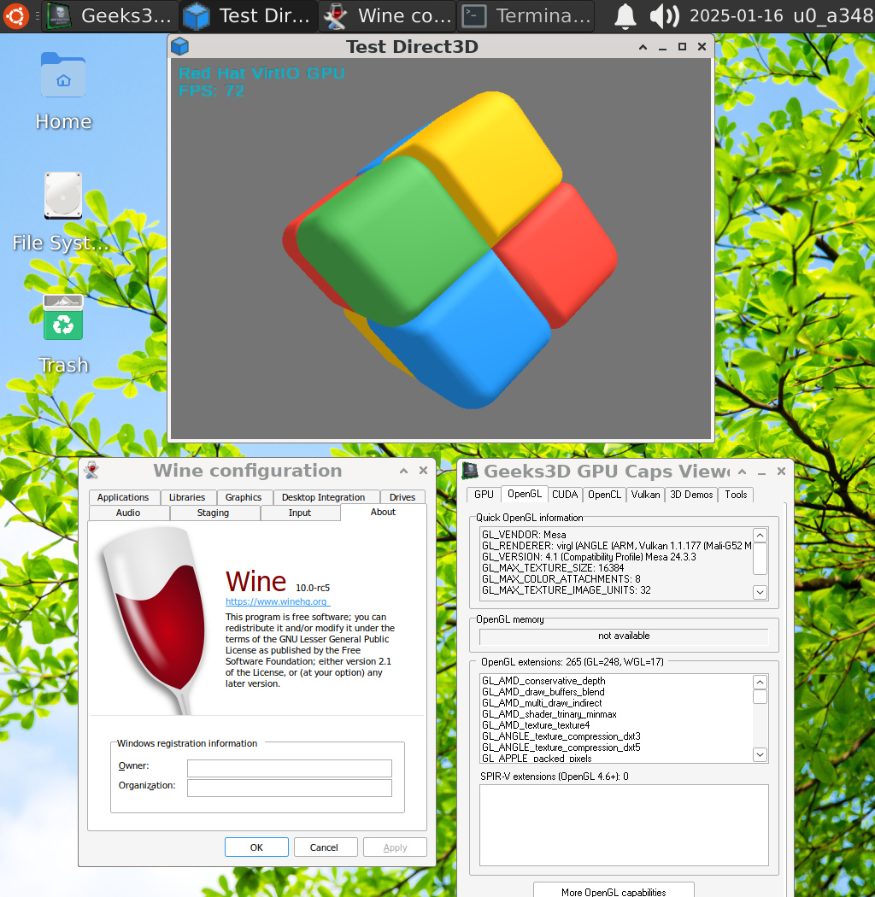

# Xow64-Wine
Wine-wow64-staging + box64 presetuped for termux-glibc (aarch64)

# Current status:
Wine version: 10.0 staging (stable)

Box64 version: 0.3.3

# Installation:
Make sure if wget is installed
```
pkg install wget openssl
```

Install xow64
```
cd $HOME && rm -rf ~/xow64 && wget https://github.com/ar37-rs/xow64-wine/raw/refs/heads/main/xow64 && chmod +x ~/xow64
```

and then
```
~/xow64 install-deps && ~/xow64 update-all
```
# Usage (on desktop environment such xfce4 native termux-x11):
[(Read for more info to setup xfce4 desktop for native termux-x11)](https://github.com/ar37-rs/xfce4-termux)

Launch winecfg
```
~/xow64 winecfg
```

Launch GPU Caps (test OpenGL and Vulkan)
```
~/xow64 gpucaps
```

Launch TestD3D (D3D9)
```
~/xow64 testd3d
```

Launch CubeMap (test EnvMapping D3D9)
```
~/xow64 cubemap
```

Launch SphereMap (test EnvMapping D3D9)
```
~/xow64 spheremap
```

Launch specific *.exe
```
~/xow64 app_name.exe
```

Launch wine in windows desktop mode, configure desktop size like so

(or any standard windows screen size)
```
~/xow64 desk-size 1024x768
```
and then simply start using
```
~/xow64 s
```

## Additional usage:
Using newer build of virgl (virpipe) driver

(For some supported GPUs and android 10+ only)
```
~/xow64 driver=virpipe
```

Using virpipe angle driver
```
~/xow64 vgl-use=angle
```

Using virpipe native android driver (less stable might using older version of virgl)
```
~/xow64 vgl-use=android
```

Configure virpipe for d3d9+ (Direct X) apps/games fix and optimizations
```
~/xow64 vgl-cfg=d3d
```

Configure virpipe for OpenGL/ES apps/games
```
~/xow64 vgl-cfg=gl
```

Using panfrost driver 
(for some specific supported mali-G valhall series only)
```
~/xow64 driver=panfrost
```

Switch back using default OpenGL driver

(using any preconfigured termux gl driver including virgl if any)
```
~/xow64 driver=default
```

Using vulkan llvmpipe (Universal CPUs)
```
~/xow64 vk=lvp
```

Using vulkan adreno/turnip driver 
```
~/xow64 vk=turnip
```

Using vulkan radeon driver (for AMD based GPUs such Xclipse)
```
~/xow64 vk=radeon
```

Using panvk (for some specific supported mali-G valhall series only)
```
~/xow64 vk=panfrost
```

Switch back using default vulkan driver (if any)
```
~/xow64 vk=default
```

Using dxvk-proton (supported on vulkan llvmpipe and any supported GPU)  
```
~/xow64 vkd3d=true
```

Disable dxvk-proton (vkd3d)
```
~/xow64 vkd3d=false
```

Enable winedlloverride for cnc-ddraw
```
~/xow64 cnc-ddraw=true
```

Disable winedlloverride for cnc-ddraw
```
~/xow64 cnc-ddraw=false
```

Disable wine debugger (for stability)
```
~/xow64 debug=false
```

Re-enable wine debugger
```
~/xow64 debug=true
```

Quit wine or terminate all wine related process
```
~/xow64 q
```

Install box64 v0.3.3
```
~/xow64 box64=0.3.3
```

Install box64 v0.3.2
```
~/xow64 box64=0.3.2
```

Install box64 v0.3.1
```
~/xow64 box64=0.3.1
```

Install box64 v0.3.0
```
~/xow64 box64=0.3.0
```

Update box64
```
~/xow64 update-box64
```

Update wine
```
~/xow64 update-wine
```

Update graphics drivers
```
~/xow64 update-drivers
```

Update angle-android using the newer version (for android 9+ only)
```
~/xow64 update-angle
```

Update dxvk-proton (vkd3d)
```
~/xow64 update-vkd3d
```

Update patch
```
~/xow64 update-patch
```

Uninstall (remove) xow64-wine
```
~/xow64 remove-all
```

# Note:
* Using virtual controller, install InputBrige

    [From here](https://github.com/ar37-rs/xow64-wine/releases/download/latest/InputBridge_v0.1.9.9.apk)

    and start command in desktop termux terminal
    ```
    ~/xow64 s
    ```
    and then `StartInputBridge.cmd` from wine start menu (desktop mode) before launching any game, then open InputBridge app on android device and then start configuring control buttons as need.

* If experiencing any emulation issue, try using different version of box64 and drivers available above accordingly.

* If there's problem when installing xow64, make sure the latest correct termux app version is installed from here:
  https://github.com/termux/termux-app/releases

* tested using termux app v0.119.0-beta.1
  
# Addtional guide:
* Using cnc-ddraw (visit link below)
  
    https://github.com/FunkyFr3sh/cnc-ddraw
  
# Other links for credits (3rd parties):
https://github.com/ptitSeb/box64

https://www.winehq.org

https://www.mesa3d.org

https://github.com/termux

https://github.com/termux/termux-x11

https://github.com/termux-pacman/glibc-packages

https://github.com/airidosas252/Wine-Builds

https://github.com/Kron4ek/Wine-Builds

https://gitlab.com/Ph42oN/dxvk-gplasync

https://github.com/doitsujin/dxvk

https://github.com/HansKristian-Work/vkd3d-proton

[InputBridge Wiki](https://search.brave.com/search?q=InputBrige%20exagear%20wiki&source=web)
